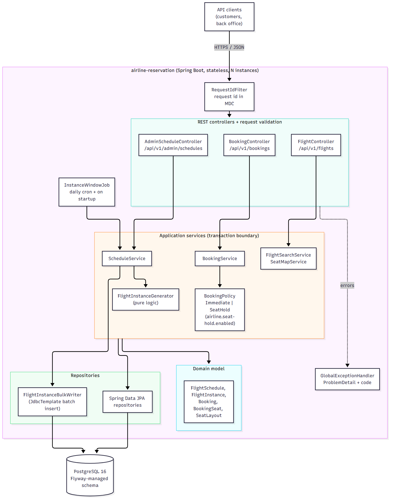
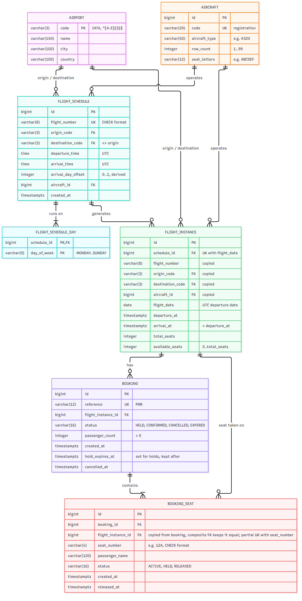
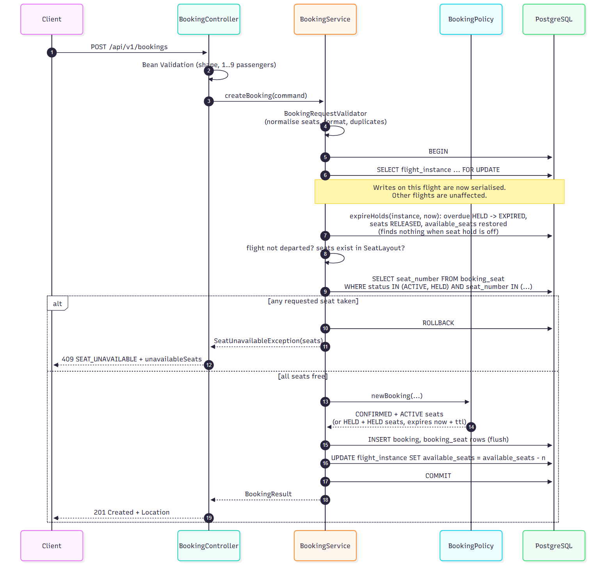
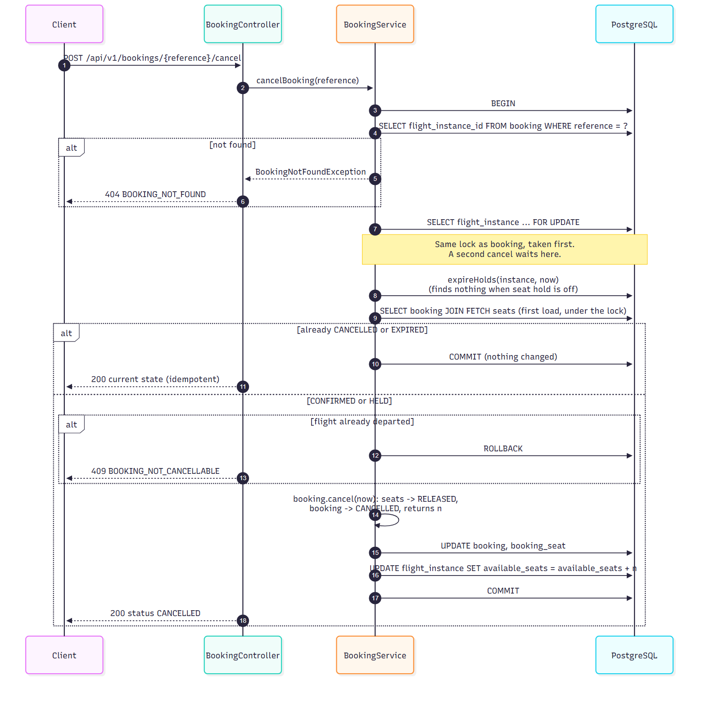
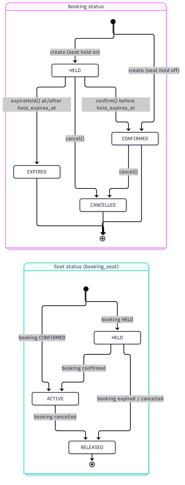

# Airline Reservation System – High-Level Design

## 1. Overview and scope

The backend for a single airline. A back office defines flight schedules; customers search
flights, view seat maps, book seats and cancel bookings. Bookings are accepted for flights up to
365 days ahead; the window is configuration (`airline.booking-window-days`).

**In scope:** schedule creation (admin), flight instance generation, flight search, seat map,
booking, booking lookup, cancellation. An optional **seat hold** (book now, confirm later) can be
enabled by configuration. It is off by default, and with it off the system behaves exactly as the
brief describes.

**Out of scope:** authentication and authorisation, payments and refunds, airport and aircraft
CRUD, schedule edits or deletes, time-zone conversion, passenger validation, multi-leg
itineraries, pricing and fare classes, a scheduled clean-up job for holds.

How to build, run and try it: [README](../README.md). Detailed design: [LLD](../lld/design.md).
Decision records with rejected alternatives: [`docs/adr`](../docs/adr/).

## 2. Architecture

One deployable Spring Boot service (a layered monolith, packaged by feature) in front of one
PostgreSQL database. The service holds no state between requests, so any number of instances
can run behind a load balancer. Every correctness guarantee is enforced by the database, not by
in-memory locks.



Source: [`diagrams/architecture.mmd`](diagrams/architecture.mmd)

| Layer | Responsibility | Rules |
| --- | --- | --- |
| REST controllers | HTTP mapping, request-shape validation (Bean Validation), status codes | No business logic, never transactional, never touch repositories |
| Application services | One public method per use case; the only transaction boundary | `@Transactional` here and nowhere else; `readOnly` for queries |
| Domain model | JPA entities with behaviour (`reserve`, `release`, `cancel`, `confirm`, `expireHold`), the `SeatLayout` value object, the `BookingStatus` state machine | No public status setters; an invalid transition throws `IllegalStateException` (a bug, never a user error) |
| Repositories | Persistence only: Spring Data JPA, plus one JDBC class for the bulk instance insert | No business rules |
| PostgreSQL | Source of truth; constraints are the last line of defence | Schema owned by Flyway; Hibernate only validates |

## 3. Components

| Component | Contents | Purpose |
| --- | --- | --- |
| `airport` | `Airport`, repository | Seeded reference data (IATA code, name, city, country) |
| `aircraft` | `Aircraft`, `SeatLayout`, repository | Seeded aircraft with a fixed seat configuration (rows × seat letters) |
| `schedule` | `AdminScheduleController`, `ScheduleService`, `FlightSchedule`, `FlightInstanceGenerator`, `InstanceWindowJob` | Back-office creation and lookup of schedules (templates); turning schedules into flight instances |
| `flight` | `FlightController`, `FlightSearchService`, `SeatMapService`, `FlightInstance`, `FlightInstanceBulkWriter` | Materialised flight instances, search and seat map |
| `booking` | `BookingController`, `BookingService`, `BookingPolicy` (+2 implementations), `BookingRequestValidator`, `PnrGenerator`, `Booking`, `BookingSeat` | Booking, lookup, confirmation, cancellation |
| `common` | `ClockConfig`, `AirlineProperties`, `GlobalExceptionHandler`, `RequestIdFilter` | Configuration, time, error contract, request-id logging |

`InstanceWindowJob` runs inside the service: a daily cron job, plus a run at startup, that keeps
every schedule's instances generated 365 days ahead.

Feature dependencies point one way, with no cycles: `booking → flight → aircraft, airport` and
`schedule → flight, aircraft, airport`; every feature may use `common`. The seat map and search
read booking-seat rows with SQL in `flight`'s persistence layer, so `flight` does not depend on
`booking` code.

### Data model



Source: [`diagrams/er.mmd`](diagrams/er.mmd). Full DDL with keys, constraints and indexes:
[`db/schema.sql`](../db/schema.sql).

- `flight_schedule` (+ `flight_schedule_day`) is the template; `flight_instance` is one dated,
  bookable flight. The route, flight number and aircraft are copied onto the instance because
  schedules never change, so search reads one table.
- `booking` holds the customer-facing reference and status; `booking_seat` holds one row per
  passenger and seat. Passengers are not a separate table: one name per seat is all the brief
  requires.
- `booking_seat.flight_instance_id` duplicates the booking's, so that the double-booking index
  can be declared on one table. A composite foreign key `(booking_id, flight_instance_id) →
  booking (id, flight_instance_id)` guarantees the copy always equals the booking's flight.

## 4. Service interactions and request flows

All endpoints live under `/api/v1`. Admin endpoints sit under `/api/v1/admin`.

### 4.1 Create schedule (back office)
`POST /admin/schedules` → `ScheduleService.createSchedule`, in one transaction:
validate (airports exist and differ, aircraft exists, at least one day, flight number unused) →
derive the arrival-day offset → insert the schedule → generate instances for
[today, today + 365] → bulk insert them → return the schedule with the generated count.

### 4.2 Search
`GET /flights?origin=&destination=&date=` → `FlightSearchService.search`, read-only:
validate the codes and that the date is inside the booking window → check both airports exist →
one indexed query on `flight_instance` by (origin, destination, date) where
`departure_at > now`, ordered by departure. No day-of-week logic runs at search time: schedules
were matched to dates when the instances were generated. `availableSeats` comes from the
instance's counter column.

### 4.3 Seat map
`GET /flights/{id}/seats` → `SeatMapService.getSeatMap`, read-only: load the instance and its
aircraft → load the seat numbers that are taken on that instance (one query) → walk the
aircraft's `SeatLayout` (row 1..N, then letters in configured order) and mark each seat `BOOKED`
or `AVAILABLE`. There is no lock: the map reflects everything committed at the moment of the
query.

### 4.4 Booking



Source: [`diagrams/booking-sequence.mmd`](diagrams/booking-sequence.mmd)

The booking is all-or-nothing: if any requested seat is taken, nothing is booked and the
response lists the taken seats.

A client may send an `Idempotency-Key` header. The key is stored on the booking it creates
with a fingerprint of the request, and it is looked up **under the flight lock**, after
expired holds are released: a retry of a request that already succeeded returns that booking
(same 201, `Location` and body, with the booking's current status) instead of a seat conflict,
and concurrent retries queue on the same flight lock, so the second one sees the first's
committed row. The same key with a different request is refused (422
`IDEMPOTENCY_KEY_REUSED`); a partial unique index on the key is the database's own guard
(ADR 0007). Without the header, nothing changes: a duplicate is still impossible, because the
seats are the natural key, but the retrying client would only learn "seat taken".

### 4.5 Cancellation



Source: [`diagrams/cancellation-sequence.mmd`](diagrams/cancellation-sequence.mmd)

Cancellation is a soft release. The booking becomes `CANCELLED` and its seats `RELEASED`, so
history is kept and the seats are bookable again at once. Cancelling twice returns the same
result both times.

### 4.6 Lookup and confirmation
- `GET /bookings/{reference}`: a read-only load by the customer-facing reference. Because the
  reference is the only credential, unsuccessful attempts are throttled per client: more than
  `airline.lookup-throttle.max-misses` (10) `BOOKING_NOT_FOUND` answers within the window (1 min)
  and lookup, confirm and cancel answer 429 `RATE_LIMITED` until the window ends. Successful
  requests never count; nothing else is throttled (ADR 0005).
- `POST /bookings/{reference}/confirm` (meaningful when the seat hold is on): locks the flight
  like cancellation does, then moves `HELD` → `CONFIRMED` if the hold has not expired. Confirming
  a booking that is already `CONFIRMED` returns it unchanged.

## 5. Flight generation strategy

**Decision: materialise one `flight_instance` row per operating date; do not materialise seats.**

- When a schedule is created, its instances for [today, today + 365] are generated in the same
  transaction. For each date in the window whose UTC day of week is one of the schedule's
  operating days, one row is created with `departure_at`/`arrival_at` as UTC instants and
  `available_seats = total_seats = rows × letters`.
- **Rolling window.** The same top-up runs daily (cron, UTC), once at startup, and on demand
  through `POST /api/v1/admin/instance-window/extend` (e.g. after lengthening the window). It
  re-generates [today, today + window + 1 day] for every schedule and inserts with
  `ON CONFLICT (schedule_id, flight_date) DO NOTHING`. The extra day means the newest bookable
  date already has its instances when the window moves at midnight, before the daily run; search
  and booking still stop at today + window. The unique constraint makes the job
  idempotent: a re-run, a run after downtime, or a run on several nodes at once inserts only
  the missing rows.
- **Seats are derived, not stored.** A seat map is the aircraft's layout minus the taken seats.
  Only booked seats have rows (`booking_seat`), so storage grows with bookings, not capacity.
- **Overnight flights.** If the arrival time is at or before the departure time, the arrival is on
  the next calendar day (`arrival_day_offset = 1`). The offset is derived, never supplied by the
  client.

Why materialise instances: a booking needs a stable row to reference by foreign key and a
concrete row to lock, and search becomes a single indexed query. Volume is small: a daily
flight is 366–367 rows a year, and a few hundred schedules come to about 100,000 rows a year.

| Alternative | Why not |
| --- | --- |
| Fully dynamic (compute instances from schedules at query time) | No row to reference or lock; seat availability would need its own keyed storage anyway; search must evaluate every schedule |
| Lazy hybrid (create the instance on first booking) | Adds a create-if-absent race to the hot booking path; search still has to compute from schedules |
| Materialise every seat (row per seat per instance) | 180–400 rows per instance, almost all never touched; up to ~40 million rows a year at the target scale for no gain |

## 6. Concurrency strategy

**Decision: a pessimistic row lock on the flight instance, backed by a partial unique index.**

1. **Primary – serialise writes per flight.** Every write transaction (book, confirm, cancel)
   starts by locking its `flight_instance` row (`SELECT ... FOR UPDATE`, JPA
   `PESSIMISTIC_WRITE`). Two requests for the same flight run one after the other; requests for
   different flights run in parallel. The seat-conflict check, the inserts and the counter
   update all happen while the lock is held.
2. **Backstop – the database refuses a double booking.** The partial unique index
   `uq_active_seat` on `booking_seat (flight_instance_id, seat_number) WHERE status IN
   ('ACTIVE','HELD')` makes it impossible to store two live claims on one seat, even if
   application logic were wrong. A violation is mapped to `409 SEAT_UNAVAILABLE`, never a 500.

**Isolation level: READ COMMITTED (the PostgreSQL default).** Each statement sees the latest
committed data. Because the seat-conflict query runs after the lock is granted, it sees every
booking committed by the previous lock holder. A stricter level adds serialisation failures and
retries without adding safety here.

**Lock timeout.** Connections set `lock_timeout = 3s`. A request that cannot get the flight
lock in time fails fast with `503 LOCK_TIMEOUT` and `Retry-After: 1` instead of queueing
indefinitely.

**Lock ordering and deadlocks.** Every write path takes the flight-instance lock first, before
reading or touching booking rows, and a transaction only ever locks one instance. With one lock
per transaction there is no cycle, so overlapping multi-seat requests (1A+1B vs 1B+1C) cannot
deadlock; one waits and then sees the other's seats as taken.

**Why cancellation needs the lock.** The booking reference identifies a fixed set of seats, and
releasing a seat twice changes nothing; the risk is the availability counter. Two unlocked
cancellations would both see `CONFIRMED` and both add the seats back, so search would advertise
seats that do not exist. The booking row is loaded only after the flight lock is held: the
second cancellation waits, then sees `CANCELLED` and returns it unchanged. Locking the flight
first on every path also keeps a single lock order, so cancellation cannot deadlock with
booking or hold expiry.

**Overload.** The failure chain under a storm on one flight is: writers wait for that flight's
lock while holding a pooled connection → the pool fills → every request thread parks waiting for
a connection → search and the health check stall too. Three bounds keep a partial slowdown from
becoming a total one: a write waits at most 3 s for the lock (`lock_timeout`), a request waits at
most 2 s for a connection (Hikari `connection-timeout`, not its 30 s default), and the pool size
is explicit (10). Both waits end in a retryable 503 (`LOCK_TIMEOUT`, `RETRY_LATER`) that changes
nothing, so clients can back off. Backpressure on booking writes (rate limiting, a circuit
breaker) and a separate read pool are not built: they can be introduced later as load requires, and
§11 lists them with their triggers. Spring itself ships neither, so the step is a library, and
the candidates are known: Resilience4j (Spring Boot starter; `@RateLimiter` and `@CircuitBreaker`
on the booking service, with `Retry-After` from the same 503 path) or Bucket4j (token buckets per
key via a servlet filter) inside the service, or Spring Cloud Gateway's `RequestRateLimiter`
(Redis-backed, cluster-wide) in front of it. The one limit that is built is on guessing, not on
load: unsuccessful booking lookups are throttled per client (§4.6). It is hand-written because
those libraries count requests, and this limit counts outcomes (404s) so that customers looking
up their own bookings are never affected; the library would still need the same interceptor
around it.

**Connection pool sizing and how it scales.** Ten connections per instance is deliberate, not
small. A booking transaction holds a connection for a few milliseconds (lock the flight, three or
four statements, commit), so ten connections serve far more requests per second than a few hundred
daily schedules generate. Pools should be small: HikariCP's guidance is about `2 × CPU cores` of
the database host, because more connections than that compete for the same CPU and disk and slow
every query down. A bigger pool also does nothing for a hot flight, whose writers queue on the row
lock one at a time whatever the pool size. The real ceiling is PostgreSQL's `max_connections`
(100 by default), shared by every application instance: `instances × pool` must stay below it.
The steps, in order, each with the signal that calls for it:

| Step | Signal |
| --- | --- |
| Raise `SPRING_DATASOURCE_HIKARI_MAXIMUMPOOLSIZE` (one variable, no code) | 503 `RETRY_LATER` from connection waits while the database CPU is idle |
| Add application instances (each brings its own pool; correctness lives in the database) | One node's CPU or threads are the limit |
| Raise `max_connections`, or put PgBouncer between the instances and PostgreSQL | `instances × pool` approaches `max_connections` |
| A separate read pool or a write bulkhead | Search latency rises during booking spikes |
| Backpressure on writes (rate limiting, a circuit breaker: Resilience4j or Bucket4j in the service, Spring Cloud Gateway in front), introduced as load requires | A sale saturates the pool faster than the 2 s / 3 s timeouts shed load |

Watch it with Hikari's metrics, which Spring Boot registers automatically:
`hikaricp.connections.active`, `.pending` (requests waiting for a connection) and `.timeout`
(waits that gave up), under `/actuator/metrics` once that endpoint is exposed
(`management.endpoints.web.exposure.include=health,metrics`).

**Measured.** `scripts/load-test.sh` runs JMeter against a throwaway copy of the stack (a
separate Compose project, seeded by SQL, removed afterwards; the README's "Load test" and
"Measured" sections have the procedure and the full table). On one laptop, 65 threads for 60 s
(20 search, 10 lookup, 5 cancellations, 10 bookings across all flights, 20 bookings on one
flight) against the pool of 10: about 2,300 requests/s in total, p95 ≤ 58 ms in every steady
scenario, no 5xx, no `LOCK_TIMEOUT`, no pool-wait timeout, and the same shape with 100k and
with 1M bookings in the database, because the hot queries are index lookups (query plans in
LLD §11). Responses are counted by status and by error code, so every refusal has its reason
(27 % of random bookings → 409 `SEAT_UNAVAILABLE`, the seat was taken). Cancellations released
seats on random flights under the booking traffic and the availability counter matched the seat
rows on every flight afterwards. The hot flight, where all 20 writers queue on one row lock,
answers in 29 ms at p50: the lock is held for milliseconds per booking. Five customers picking
the same seat in the same instant end
with exactly one 201 and four 409s, one active booking for the seat, the counter intact: the
guarantee of this section observed over HTTP under load, not only in the JUnit race test. In a separate throttle run, two clients guessing references get ten 404s and then only 429
`RATE_LIMITED` (60,000 refusals in 20 s at p50 0 ms), refused before any database work. In one
load run a PostgreSQL checkpoint stalled I/O for about 6 s: 0.15 % of requests
got 503 `RETRY_LATER` within the 2 s connection bound and nothing else was affected, which is
the fail-fast behaviour described above, seen for real. Relative numbers (client, application and
database on one machine), useful for the shape, not for capacity planning.

| Alternative | Why not |
| --- | --- |
| Optimistic locking (`@Version` on the instance or booking) | Popular flights are high-contention writes; optimistic versions turn contention into failed requests and client retries. The row lock is held for milliseconds |
| Unique index only, no lock | Prevents double booking, but cannot keep the availability counter consistent without more machinery, and gives vaguer errors for multi-seat requests |
| Per-seat row locks | Needs a row per seat (see §5) and multi-seat requests must lock in a fixed order to avoid deadlocks |
| JVM locks (`synchronized`, in-memory maps) | Only correct on a single instance; breaks as soon as the service scales out |
| SERIALIZABLE isolation | Correct, but shifts the problem to retry loops on serialisation failures |

## 7. Seat availability

`flight_instance.available_seats` is a counter maintained inside the transaction that holds the
flight lock: decremented by a booking (or hold), incremented by a cancellation (or expiry).
Search reads it directly, with no aggregation. A `CHECK (available_seats BETWEEN 0 AND
total_seats)` bounds it. The invariant, asserted in tests, is:

```
available_seats = total_seats − count(booking_seat rows with status ACTIVE or HELD)
```

## 8. Seat hold (optional, off by default)

Enabled with `airline.seat-hold.enabled=true`; hold length `airline.seat-hold.ttl` (default
10 minutes). The choice is a Strategy (`BookingPolicy`) selected once from configuration:
`ImmediateConfirmationPolicy` (default) or `SeatHoldPolicy`.



Source: [`diagrams/booking-state.mmd`](diagrams/booking-state.mmd)

- **Create:** the booking is `HELD`, its seats `HELD`, with `hold_expires_at = now + ttl`. A held
  seat is protected by the same unique index and counted out of `available_seats` exactly like a
  confirmed one.
- **Confirm:** `HELD` → `CONFIRMED`, seats → `ACTIVE`, only if `hold_expires_at > now`;
  otherwise `409 HOLD_EXPIRED`.
- **Lazy expiry, no scheduler:** every write transaction that locks a flight (book, confirm,
  cancel) first expires that flight's overdue holds: booking → `EXPIRED`, seats → `RELEASED`,
  counter restored. It runs under the flight lock, so it cannot race with a confirm or a new
  booking.
- **Reads never write; they compute around overdue holds:** the seat map shows a seat on an
  overdue hold as `AVAILABLE`; search adds seats on overdue holds back to the counter (one
  grouped count query after the instance search); `GET /bookings/{reference}` reports an overdue
  `HELD` booking as `EXPIRED`.
- **The flag is read only from `AirlineProperties`**: where the `BookingPolicy` is chosen, and
  in the two places that would otherwise run hold-specific queries (expiry on writes, the
  overdue-hold count on search). With the flag off those queries are skipped, so the default path
  pays nothing for the feature; the seat map's single query and `effectiveStatus` need no branch.
- **Seat map states stay two:** a live hold shows as `BOOKED`.

## 9. Major design decisions

| Decision | Chosen | Alternatives considered | Why |
| --- | --- | --- | --- |
| Instance generation | Materialised instances, derived seats | Dynamic, lazy hybrid | Stable row to lock and reference; one-query search (§5) |
| Concurrency | Flight row lock + partial unique index | Optimistic versioning, index only, JVM locks | Serialises contended writes cheaply, works across nodes, DB backstop (§6) |
| Availability | Counter maintained under the lock | `COUNT(*)` per search | Search needs no aggregation; invariant tested |
| Cancellation | Soft release (status change) | Delete rows | Keeps history; partial index frees the seat immediately |
| Booking reference | 6-character PNR from an unambiguous alphabet, `SecureRandom` | UUID, sequence | Readable for customers, not guessable; unique constraint is the final guard |
| Lookup and cancel | By booking reference only | Reference + surname | No authentication in scope; the reference is the bearer secret |
| Cancellation rules | One rule ("before departure"), a single check inline in `BookingService` | A `CancellationPolicy` Strategy | Only one rule exists; a Strategy earns its place when a second implementation does, as `BookingPolicy` shows |
| Seat hold | Strategy behind a flag, lazy expiry | Always-on holds, scheduled clean-up | Brief describes one-step booking; the flag shows the extension without changing default behaviour |
| Package structure | By feature (`schedule`, `flight`, `booking`), layered inside | Package by layer | Related code changes together; feature boundaries are visible and testable (ArchUnit) |
| Error format | RFC 9457 `ProblemDetail` + machine-readable `code` and `requestId` on every error, framework errors included | Custom error body | Standard shape, supported natively by Spring; clients branch on `code`, support traces by `requestId` |
| Input-error status | `400` for all invalid input; `409` for conflicts with resource state | `422` for well-formed but rule-breaking input | Clients branch on `code`; one 4xx for "your input is wrong" keeps the contract simple |
| Database | PostgreSQL 16, Flyway | MySQL, H2 | Partial indexes, `ON CONFLICT`, transactional DDL; tests run on the same engine via Testcontainers |
| Authentication | None; admin under `/admin` | Spring Security | Out of scope by the brief; the path split is where role-based access would attach |
| Safe retries | Optional `Idempotency-Key` stored on the booking it created, with a request fingerprint; looked up under the flight lock; 422 on reuse (ADR 0007) | A separate key table with stored responses; checking before the lock; a mandatory header | The key identifies exactly one booking, so the booking row is its home and the replay is the live row; after the lock, concurrent retries see the committed booking; optional keeps the brief's API unchanged |
| Guessing protection | Per-client limit on unsuccessful lookups, as a Spring MVC interceptor on the reference endpoints | A servlet filter; a library rate limiter (Resilience4j, Bucket4j); nothing in-app | Counts only misses, so customers are never affected; the libraries count requests, not outcomes, so the same interceptor would still be needed around them; the interceptor matches exactly what Spring routes, so no path variant bypasses it; the body comes from the one error handler |
| Time | UTC everywhere; injected `Clock` | System time | Deterministic tests; no dependence on host time zone |

## 10. Assumptions

**From the assignment brief**
- The system serves a single airline.
- Airports and aircraft are preloaded through seed data; their CRUD operations are out of scope.
- The seat map is fixed for each aircraft.
- Flight schedules do not change after creation.
- A booking covers a single flight instance, and a seat belongs to only one booking.
- All timestamps are stored in UTC; time-zone conversion is out of scope.
- Payment and refund processing are out of scope.

**Additional assumptions**
1. **Schedule times:** departure and arrival times entered through the admin API are interpreted
   as UTC.
2. **Overnight flights:** an arrival time earlier than the departure time means arrival on the
   following calendar day. Flights longer than 24 hours are out of scope.
3. **Booking window:** flights are bookable from the current UTC date up to and including 365
   days ahead; the window advances daily.
4. **Authentication:** user accounts and authentication are out of scope. Administrative
   endpoints are separated under `/admin` and would be protected by role-based access in
   production. Bookings are retrieved and cancelled using the booking reference.
5. **Seat hold:** booking is a single step and seats are confirmed immediately, as described in
   the brief. An optional seat hold can be enabled through configuration
   (`airline.seat-hold.enabled`, default `false`; `airline.seat-hold.ttl`). When enabled, seats
   are held until confirmation or expiry; expired holds are released when availability is next
   checked. A scheduled clean-up job is not included.
6. **Double booking:** a seat on a flight instance cannot be assigned to more than one active
   booking. The same passenger name may appear on more than one booking, as passenger
   validation is not required.
7. **Passengers:** each seat is assigned to one passenger, identified by name only. A booking
   contains at most 9 passengers.
8. **Departed flights:** flights that have already departed cannot be booked or cancelled.
9. **Cancellation:** cancellation applies to the whole booking; partial cancellation is out of
   scope. Cancelling an already cancelled booking returns its current state.
10. **Seat map:** the seat map reflects the committed booking state at the time of the request;
    push updates are out of scope.
11. **Scale:** the design targets a few hundred daily schedules (roughly 100,000 flight
    instances a year). Application instances are stateless and can be scaled horizontally, with
    the database as the source of truth for seat inventory.
12. **Flight numbers:** each flight number identifies exactly one schedule.
13. **Schedule validity:** a schedule takes effect from its creation date and has no end date.
14. **Seat selection:** seats are chosen explicitly by the customer; there is no
    auto-assignment.
15. **Aircraft rotation:** conflicts from one aircraft operating two overlapping flights are not
    validated.

## 11. Scaling and evolution

Not built; each step is listed with the signal that would justify it.

| Step | Trigger |
| --- | --- |
| Horizontal scaling of the service behind a load balancer | Already possible (stateless, DB-enforced correctness); do it when CPU or request latency on one node becomes the limit |
| Serve search and seat map from a read replica or a short-TTL cache | Read traffic dominates and the primary's load grows; accept slightly stale availability, keep booking on the primary |
| Partition `flight_instance` and `booking_seat` by flight date; archive departed flights | Tables reach tens of millions of rows or index maintenance slows writes |
| Scheduled clean-up of expired holds | Seat hold is enabled and flights with stale holds see few writes, so lazy expiry lags in reports |
| Finer-grained locking (per seat) | Measured lock waits on a single very popular flight become significant |
| A `CancellationPolicy` Strategy (cut-off before departure, admin override, fees), like `BookingPolicy` | The business defines a second cancellation rule |
| Partial cancellation (some passengers only) | Customers ask to drop one passenger; seat-level status and `released_at` already support it, no migration needed |
| Surname check alongside the reference for lookup and cancel; a mismatch returns 404 like an unknown reference | Self-service is exposed beyond trusted channels without user accounts; a strict match would split `passenger_name` into first and last name (additive migration) |
| Value types for seat labels and booking references | Seats gain attributes (class, window/aisle) or seat strings travel through many APIs |
| Authentication and role-based access on `/admin` | Any deployment beyond a demo |
| Cluster-wide lock for the daily job (e.g. ShedLock), so one node runs it | Many nodes each repeating the (idempotent) daily run becomes costly |
| Distributed tracing (OpenTelemetry via Micrometer Tracing; `traceId` in the log pattern, `traceparent` honoured) | A second service or asynchronous messaging. Today correlation is the `requestId` on every log line (job runs: `job-startup-…`/`job-daily-…`) and in every error response |
| Backpressure on booking writes: rate limiting and a circuit breaker, introduced as load requires. In the service: Resilience4j (`@RateLimiter`, `@CircuitBreaker` on `BookingService`) or Bucket4j; in front of it: Spring Cloud Gateway `RequestRateLimiter` with Redis for a cluster-wide limit | A sale on one flight saturates the pool faster than the fail-fast timeouts (§6 "Overload") shed load |
| A separate read pool, or a write bulkhead | Search latency rises during booking spikes |
| Cluster-wide lookup throttle at the edge | The in-service throttle on unsuccessful lookups is per instance; many instances multiply a guesser's budget (ADR 0005) |
| Aircraft-rotation check (same aircraft on overlapping flights, with turnaround time) | Schedules are planned in this system rather than imported from a fleet-planning tool |

### Multiple airlines

The brief is single-airline, but no part of the design depends on it.

- **Already works with no change.** The airline code is the first two characters of every flight
  number (`XY101`, `EK001`), so schedules of several airlines coexist and their flight numbers
  cannot clash under the existing unique constraint. Flights of different airlines on the same
  route at the same time are normal and need no validation; search returns all of them. The flight
  lock is per flight instance, so airlines never block each other. Instance generation, booking,
  cancellation and the seat hold are unchanged.
- **Aircraft ownership and airline data** → an `airline` reference table (like `airport`) and
  `aircraft.airline_code` (one additive migration), plus a check in `ScheduleService` that a
  schedule's flight-number prefix matches its aircraft's airline. Today any schedule may use any
  aircraft, and the prefix is not validated. *Trigger: a second airline is onboarded.*
- **Codeshares** → store the operating carrier explicitly; the flight-number prefix is only the
  marketing carrier. *Trigger: flights sold under another airline's number.*
- **Isolation between airlines** → an airline id on owned tables enforced on every query (e.g.
  PostgreSQL row-level security) and airline-scoped admin authentication. *Trigger: the system is
  offered as a platform to separate airlines.*
- **Not covered for one airline or many:** aircraft-rotation clashes (table above) and airport
  slot or capacity limits (handled by slot coordination outside a booking system).

## Changelog

| Date | Change |
| --- | --- |
| 2026-10-07 | Initial design |
| 2026-10-08 | Phase 2: `ApiException` is one concrete class carrying an `ErrorCode`; subclasses only for errors with extra fields (LLD §2) |
| 2026-10-08 | Phase 3: search adds back seats on overdue holds with a second grouped query, not a correlated subquery (HLD §8, LLD §8) |
| 2026-10-08 | Phase 4: the booking seat-conflict check reuses `SeatOccupancyQueries.takenSeats`, so seat map, search and booking share one definition of a taken seat (LLD §2, §7) |
| 2026-10-08 | Phase 5: cancellation rules behind `CancellationPolicy`; lock order and idempotent cancel as designed (no change to this document) |
| 2026-10-08 | Phase 4b: `hold_expires_at` is kept after a hold ends (ER diagram and schema snapshot wording); hold expiry rounded to whole seconds; expiry flushes before the SQL seat check (LLD §8) |
| 2026-10-08 | Phase 6: incoming `X-Request-Id` accepted only if safe (≤ 64 chars, `[A-Za-z0-9._-]`), else a UUID (LLD §2) |
| 2026-10-08 | Configurable window: `airline.booking-window-days` is the single definition of the window (`AirlineProperties.lastBookableDate`), now also enforced at booking; `Retry-After` is configuration (`airline.retry-after`); Compose passes `AIRLINE_*` overrides through (LLD §2, §5, §6) |
| 2026-10-08 | Phase 8: documentation finished: links to README and ADRs; multiple-airlines and aircraft-rotation notes in §11; LLD aligned with the final code |
| 2026-10-08 | Phase 9: manual top-up endpoint `POST /admin/instance-window/extend` (§5); a booking-reference clash returns 503 `RETRY_LATER` instead of 500; `airline.retry-after` shared by both 503s; job runs log under their own id; tracing and scheduler-lock rows in §11 (LLD §2, §4, §6, §7, §9) |
| 2026-10-09 | Phase 10 (hardening): cancellation rule inlined (no `CancellationPolicy`); hold queries skipped with the flag off (§8); instances generated one day past the window (§5); startup top-up never aborts boot; V5 composite FK and format CHECKs (data model); PostgreSQL published on 5433 |
| 2026-10-09 | Phase 11: overload bounds made explicit (connection timeout 2 s, pool size 10; §6 "Overload"); pool exhaustion → 503 `RETRY_LATER`, a dropped connection stays 500; evolution rows for rate limiting, a read pool and a lookup throttle (§11) |
| 2026-10-09 | Phase 12: unsuccessful booking lookups throttled per client (429 `RATE_LIMITED`, §4.6, §9); write-side backpressure recorded as a later step introduced as load requires (§6, §11) |
| 2026-10-09 | Phase 13: load test on a throwaway stack (JMeter, SQL seed) and the measured figures (§6); query plans at 1M bookings (LLD §11); Swagger demo walkthrough (README) |
| 2026-10-10 | Phase 14: optional `Idempotency-Key` on booking creation, stored on the booking and checked under the flight lock (§4.4, §9, ADR 0007); V6 adds the columns and the partial unique index |
| 2026-10-10 | Simplification pass: error subclasses folded into `ApiException`, the request fingerprint into `BookingService`; no behaviour or schema change (353 tests, smoke, load and throttle runs unchanged) |
